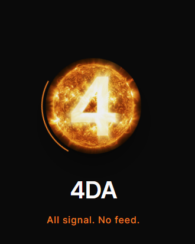
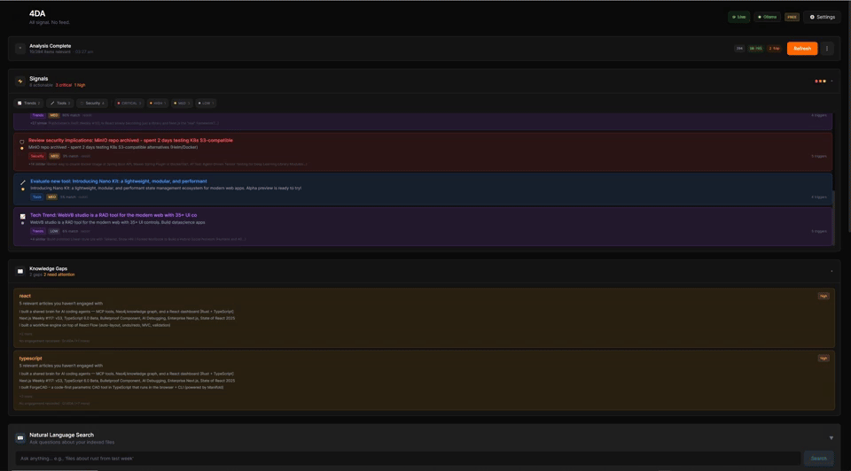
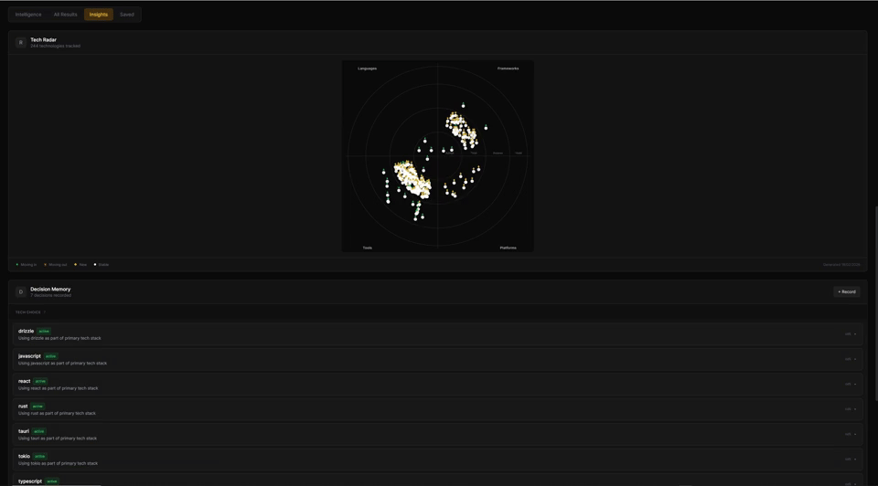

<div align="center">



<br />

[](LICENSE)
[](https://www.npmjs.com/package/@4da/mcp-server)
[](#download)

**All signal. No feed.**

4DA scores content from 11 sources against your actual codebase using 5-axis relevance scoring. An item needs 2+ independent signals to survive. Everything else is rejected. Typical rejection rate: **99%+**.

Privacy-first. Runs locally. Zero telemetry. BYOK. ~15MB download.

[Download](#download) &bull; [Quick Start](#quick-start) &bull; [How It Works](#how-it-works) &bull; [MCP Integration](#mcp-integration) &bull; [Pricing](#pricing)

</div>

---

## Download

> **Pre-built binaries** — no Rust toolchain required.

| Platform | Download | Auto-updates |
|----------|----------|:------------:|
| **Windows** | [`.msi` installer](https://github.com/runyourempire/4DA/releases/latest) | Yes |
| **macOS** | [`.dmg` (Apple Silicon & Intel)](https://github.com/runyourempire/4DA/releases/latest) | Yes |
| **Linux** | [`.AppImage` / `.deb`](https://github.com/runyourempire/4DA/releases/latest) | Yes |

Or install the **MCP server** for Claude Code / Cursor:
```bash
npx @4da/mcp-server
```

Or build from source — see [Quick Start](#quick-start).

---

## See It In Action

<p align="center">
  
  <br />
  <em>Scored feed — every item earns its place through 5-axis relevance scoring</em>
</p>

<p align="center">
  
  <br />
  <em>Intelligence Briefing — AI-generated daily summary with curated top picks</em>
</p>

<p align="center">
  
  <br />
  <em>Search + Score Autopsy — see exactly why an item scored the way it did</em>
</p>

<p align="center">
  
  <br />
  <em>Tech Radar, Decision Memory, and Developer DNA — your full tech identity</em>
</p>

---

## The Problem

You skim 500+ articles a day trying to stay current. You miss the security advisory for a package you actually use. You read three "intro to X" posts about tech you already know. You never see the arXiv paper that's directly relevant to your current project.

Meanwhile, your dependency has a breaking change, and you find out when production breaks.

## The Solution

4DA runs locally on your machine. It scans your projects, reads your `Cargo.toml` / `package.json` / `go.mod`, watches your Git activity, and builds a **domain profile** — a graduated understanding of your technology identity.

Then it scores every piece of incoming content against 5 independent signal axes:

| Axis | What it measures |
|------|-----------------|
| **Context** | Semantic similarity to your active codebase |
| **Interest** | Alignment with your declared and learned topics |
| **ACE** | Real-time signals from your Git commits and file edits |
| **Dependency** | Direct matches against your installed packages |
| **Feedback** | Save/dismiss signals boost or suppress future scores |

An item needs **2+ independent signals** to pass the confirmation gate. Everything else gets rejected. Typical rejection rate: **99%+**.

What survives is scored with content quality analysis (kills clickbait), novelty detection (demotes "intro to X" if you're advanced), competing tech penalties, and intent scoring from your recent work.

## Features

**Intelligence**
- 5-axis scoring with multi-signal confirmation gate (99%+ rejection rate)
- Domain profile: graduated tech identity (primary stack → dependencies → detected → interests)
- Content DNA: classifies content type (security advisory, release, tutorial, hiring, etc.)
- Novelty detection: demotes introductory content, boosts new releases
- Intent scoring: recent Git/file activity influences what surfaces
- Knowledge gap detection: finds blind spots in your dependency understanding

**Sources** — 11 adapters, all running locally
- GitHub, YouTube, Hacker News, Reddit, arXiv
- Product Hunt, Twitter/X, Dev.to, Lobsters
- Custom RSS feeds

**Analysis**
- Signal chains: tracks evolving stories across sources
- Semantic shift detection: notices when topics you follow are changing
- Reverse mentions: finds where your projects are discussed
- Project health radar: dependency freshness + security monitoring
- Attention dashboard: where you spend time vs. where you should

**Decision Intelligence**
- Record and query architectural decisions across sessions
- Tech radar: adoption signals from decisions + content trends
- Decision enforcement: AI agents check alignment before suggesting changes

**Agent Autonomy**
- Cross-session, cross-agent persistent memory
- Session briefs: tailored startup context for any AI tool
- Delegation scoring: should the agent proceed or ask you?
- Developer DNA: exportable tech identity profile

**Privacy & Control**
- All data stays on your machine. Raw content never leaves.
- BYOK: Anthropic Claude, OpenAI, or fully local with Ollama
- ed25519 license verification (public key embedded, private key server-side)
- Auto-updates via Tauri updater with GitHub releases
- System tray: runs in background, surfaces what matters

## Quick Start

**Prerequisites:** [Rust](https://rustup.rs/) 1.70+, [Node.js](https://nodejs.org/) 18+, [pnpm](https://pnpm.io/)

```bash
git clone https://github.com/runyourempire/4DA.git
cd 4DA
pnpm install
pnpm tauri dev
```

The app opens, walks you through onboarding (pick your stack, add an API key, point at your project directories), and runs your first scan. First useful results in under 3 minutes.

### Production Build

```bash
pnpm tauri build
```

Creates platform-specific installers (`.msi` / `.dmg` / `.AppImage`) in `src-tauri/target/release/bundle/`.

## How It Works

```
Your Codebase                    External Sources
     │                                │
     ▼                                ▼
┌─────────────┐              ┌──────────────┐
│     ACE     │              │  11 Source    │
│  Scanner +  │              │  Adapters     │
│  Git Watch  │              │  (background) │
└──────┬──────┘              └──────┬───────┘
       │                            │
       ▼                            ▼
┌──────────────────────────────────────────┐
│           5-Axis Scoring Engine          │
│                                          │
│  context ─┐                              │
│  interest ─┼─ confirmation gate (2+ of 5)│
│  ace ──────┤                             │
│  dependency┤   × quality × novelty       │
│  learned ──┘   × domain × intent         │
└──────────────────┬───────────────────────┘
                   │
                   ▼
          ┌─────────────────┐
          │  Signal + Feed  │
          │  (what survived)│
          └─────────────────┘
```

## Developer DNA

4DA builds a **Developer DNA** profile from your codebase and behavior — a quantified snapshot of your technology identity.

- **Primary stack**: what you declared + what ACE detected
- **Dependency graph**: every package you actually use
- **Topic engagement**: where your attention goes
- **Blind spots**: gaps between what you use and what you track

Shareable as markdown.

## MCP Integration

4DA ships with a Model Context Protocol server — plug your intelligence feed directly into Claude Code, Cursor, or any MCP-compatible tool.

```bash
cd mcp-4da-server
pnpm install && pnpm build
```

**30 tools across 8 categories:**
- **Core** — `get_relevant_content`, `get_context`, `explain_relevance`, `record_feedback`
- **Intelligence** — `daily_briefing`, `get_actionable_signals`, `score_autopsy`, `trend_analysis`, `context_analysis`, `topic_connections`, `signal_chains`, `semantic_shifts`, `attention_report`
- **Diagnostic** — `source_health`, `config_validator`, `llm_status`
- **Innovation** — `knowledge_gaps`, `project_health`, `reverse_mentions`, `export_context_packet`
- **Decision Intelligence** — `decision_memory`, `tech_radar`, `check_decision_alignment`
- **Agent Autonomy** — `agent_memory`, `agent_session_brief`, `delegation_score`
- **Developer DNA** — `developer_dna`
- **Intelligence Metabolism** — `autophagy_status`, `decision_windows`, `compound_advantage`

Add to your Claude Code config:
```json
{
  "mcpServers": {
    "4da": {
      "command": "node",
      "args": ["path/to/mcp-4da-server/dist/index.js"]
    }
  }
}
```

## Tech Stack

| Layer | Technology |
|-------|-----------|
| App Shell | Tauri 2.0 (Rust backend + WebView) |
| Frontend | React 19 + TypeScript + Tailwind CSS v4 |
| Database | SQLite 3.45+ with sqlite-vec (vector search) |
| Scoring | Custom DSL → build-time Rust codegen |
| Embeddings | OpenAI text-embedding-3-small / Ollama |
| LLM | Anthropic Claude / OpenAI / Ollama |

## Philosophy

1. **Privacy first** — raw data never leaves your machine
2. **BYOK** — your keys, your models, your choice
3. **Local first** — works offline with Ollama
4. **Minimal** — no feature bloat; every element earns its place
5. **Signal over noise** — 99%+ rejection rate is a feature, not a bug

## CLI

The CLI reads from the same database as the desktop app. No extra setup needed.

```bash
4da briefing               # Latest AI briefing
4da signals                # All classified signals
4da signals --critical     # Critical/high priority only
4da gaps                   # Knowledge gaps in your dependencies
4da health                 # Project dependency health
4da status                 # Database stats
```

Download the CLI binary from [Releases](https://github.com/runyourempire/4DA/releases), or build from source:
```bash
cd src-tauri && cargo build --release --bin 4da
```

## Development

```bash
pnpm tauri dev              # Dev server (localhost:4444)
cargo test                  # Rust tests (from src-tauri/)
pnpm test                   # Frontend tests (157)
pnpm validate:all           # Full validation (lint + types + tests + build)
```

## Why Not Just Use...

| Tool | Approach | Limitation |
|------|----------|------------|
| **daily.dev** | Personalizes by engagement (what you click) | Optimizes for curiosity, not project relevance. Click on one ZFS article, get storage content for weeks. |
| **Feedly** | Aggregates by subscription (what feeds you add) | Solves aggregation, not relevance. 100+ feeds = a different firehose. AI features locked behind $156/yr. |
| **Pocket** | Saves what you manually bookmark | Shut down July 2025. Cloud-dependent tools can disappear. |
| **TLDR / newsletters** | Someone else curates for "developers" broadly | One person's bias. "Developers" includes React engineers, ML researchers, and game devs — one newsletter fits none. |
| **4DA** | Scores against your actual codebase (Cargo.toml, package.json, Git) | Requires a local codebase to scan. That's the point. |

4DA doesn't personalize by what you click or subscribe to. It scores by what you **build**. Categorically different.

## Pricing

**Free** — $0 forever. No credit card. No account. No expiration.
- All 11 sources, full 5-axis scoring engine, confirmation gate, feedback-driven scoring, STREETS Playbook (all 7 modules), MCP server (30 tools), CLI

**Pro** — $12/month or $99/year. BYOK — you bring your own API key.
- Everything in Free, plus: AI daily briefings, Developer DNA profiling, Score Autopsy, intelligence panels, signal chain analysis, knowledge gap detection

## License

[FSL-1.1-Apache-2.0](LICENSE) — free to use. Source available for inspection. Converts to Apache 2.0 two years after each release.

---

<div align="center">

**4DA** — *4 Dimensional Autonomy*

All signal. No feed.

</div>
