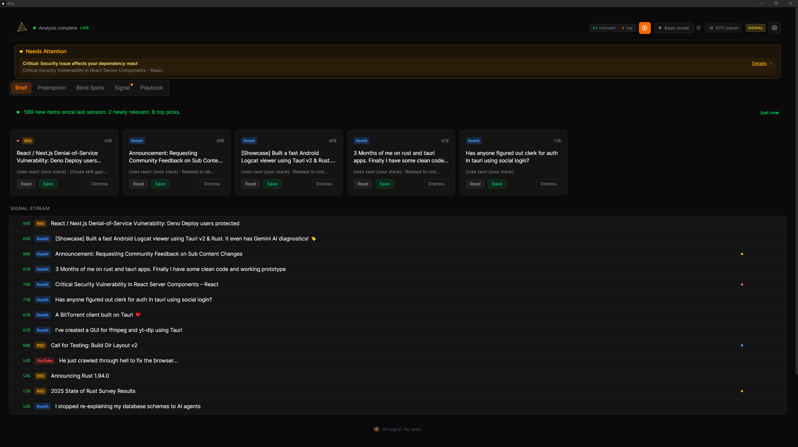
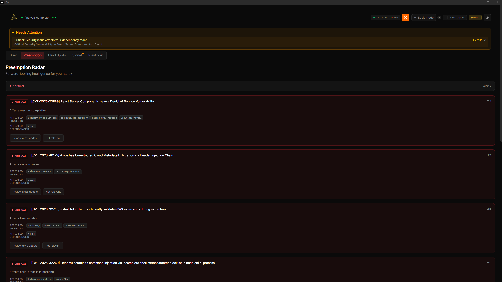
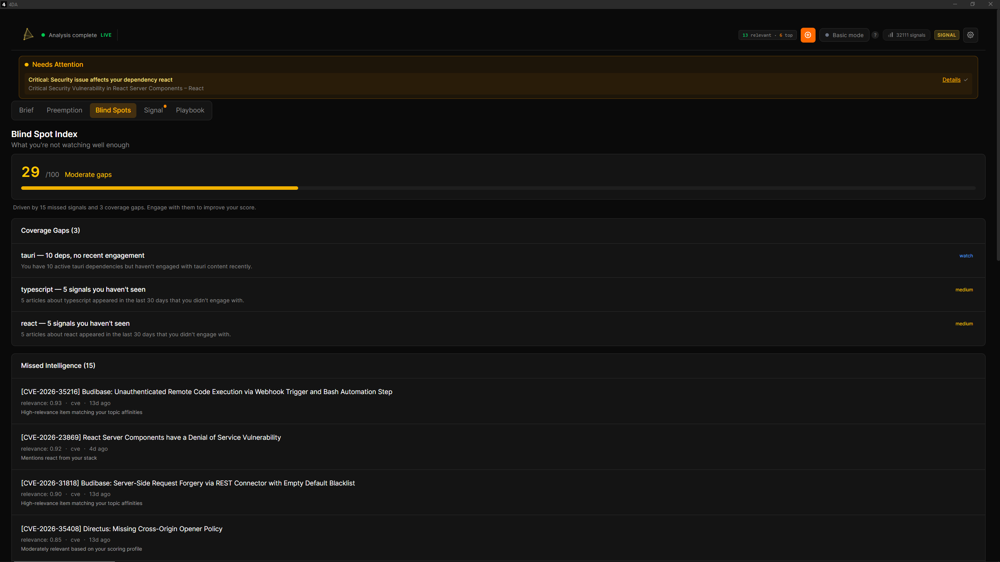
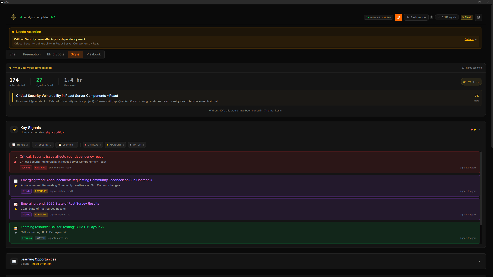

<div align="center">


<br />

[](https://github.com/runyourempire/4DA/actions/workflows/validate.yml)
[](LICENSE)
[](https://www.npmjs.com/package/@4da/mcp-server)
[](#download)

**All signal. No feed.**

</div>

---

**4DA reads the internet for developers — privately, locally — and gets sharper every day.**

It scans your codebase — `Cargo.toml`, `package.json`, `go.mod`, Git history — and scores every article, advisory, and release from 20+ sources against what you actually build. An item needs 2+ independent signals to survive. Everything else is rejected.

Tested across 9 developer personas: **92% of content is filtered as noise, 98% of actual noise is correctly rejected.** Your real rejection rate — computed from your own data — is shown in the Evidence tab.

It learns from how you engage with what it shows you. Save something — topics boost, source reputation rises, your taste embedding sharpens. Dismiss something — anti-patterns form, future noise drops. Yesterday's noise becomes tomorrow's signal.

### The fastest way to try it

Already using Claude Code, Cursor, or Windsurf? One command:

```bash
npx @4da/mcp-server
```

This scans your project, detects your stack, and gives your AI assistant live vulnerability scanning, dependency health, upgrade planning, and ecosystem intelligence. No API keys. No accounts. Works standalone — no desktop app required. [Full MCP documentation.](mcp-4da-server/)

<p align="center">
  
</p>

---

## How It Works

### Scoring

5 independent signal axes. An item must pass **2 or more** to surface. Single-axis matches are hard-capped at 28% — no matter how strong one signal is, it cannot pass alone.

| Axis | What it measures |
|------|-----------------|
| **Context** | Semantic similarity to your active codebase |
| **Interest** | Alignment with your declared and learned topics |
| **ACE** | Real-time signals from your Git commits and file edits |
| **Dependency** | Direct matches against your installed packages |
| **Learned** | Save/dismiss feedback boosts or suppresses future scores |

What passes the gate goes through 12 quality multipliers: content depth, novelty detection, competing tech penalties, title-body coherence, and intent scoring from recent work. Every constant is calibrated across 9 simulated developer personas with 215 labeled test items.

### LLM Verification

After keyword scoring, an LLM layer verifies the top items against your full developer context — stack, dependencies, recent commits, anti-technologies, and engagement history. Strict 1-5 rubric:

- **5 = MUST-READ**: Security alert for YOUR dependency, breaking change YOU must act on
- **3 = WORTH KNOWING**: Useful tool that fits YOUR exact stack
- **1 = NOISE**: Mentions your tech but isn't actionable

This is where the gold surfaces — articles the keyword pipeline misses because there's no keyword overlap, but the LLM understands the conceptual relevance to your specific project.

**You own the compute.** Use [Ollama](https://ollama.com/) for free local inference (fully private), or bring your own Anthropic/OpenAI key. 4DA never pays for your compute, never stores your keys remotely, never makes API calls you didn't configure.

### Anti-Gaming

Content creators who learn the scoring algorithm still can't game it:

- **Title-body coherence**: titles must deliver on what they promise. Claim "React + Rust + Tauri" but only discuss React? Penalty.
- **Keyword concentration**: repeating "Rust" four times in a title hurts your score.
- **Confirmation gate**: keyword-stuffing hits one axis. Without matching the user's codebase, installed packages, AND recent work — the gate rejects it.
- **Feedback loop**: gamed articles get dismissed. Sources that produce dismissed content lose reputation. Gaming becomes self-defeating.

No algorithm can be gamed when the scoring signal comes from your local filesystem. Your `Cargo.lock` doesn't lie.

---

## Privacy & Trust

4DA is local-first and direct-to-provider. There is no 4DA-operated server, no analytics, and no user account system. Your indexed content, scores, and intelligence live in a SQLite database on your machine.

**The only outbound traffic:**

| Category | Where | Why |
|----------|-------|-----|
| Source adapters | HN, GitHub, Reddit, arXiv, etc. | Fetching public content you configured |
| LLM providers | Anthropic / OpenAI / localhost Ollama | Only if YOU set up BYOK keys |
| License validation | Keygen | Only if you activated a paid license |
| Updater | GitHub Releases | Signed via minisign, once per session |
| Crash reports | Sentry | **Off by default.** Opt-in only. |

That's the whole list. There is no 4DA telemetry endpoint because there is no 4DA cloud.

Don't take our word for it:

| | |
|---|---|
| [**Network Transparency**](NETWORK.md) | Every outbound connection, with source code references |
| [**Trust Architecture**](docs/TRUST-ARCHITECTURE.md) | Why local-first means you don't need to trust us |
| [**Privacy (Plain Language)**](docs/PRIVACY-PLAIN-LANGUAGE.md) | One-page, no-legalese privacy summary |
| [**Security Audit Guide**](docs/SECURITY-AUDIT-GUIDE.md) | Map of trust-critical code paths for auditors |
| [**Build from Source**](docs/BUILD-FROM-SOURCE.md) | Compile it yourself and verify the binary |

---

## Download

> **Pre-built binaries** — no Rust toolchain required.

| Platform | Download | Auto-updates |
|----------|----------|:------------:|
| **Windows** | [`.exe` installer](https://github.com/runyourempire/4DA/releases/latest) | Yes |
| **macOS** | [`.dmg` (Apple Silicon & Intel)](https://github.com/runyourempire/4DA/releases/latest) | Yes |
| **Linux** | [`.AppImage` / `.deb`](https://github.com/runyourempire/4DA/releases/latest) | Yes |

Every release publishes `SHASUMS256.txt` and per-file `.sha256` sidecars. [Verification instructions.](docs/VERIFY-DOWNLOADS.md)

> **Windows users:** SmartScreen will prompt on first launch (new application, building reputation). Click **More info → Run anyway**. [Full details.](docs/launch/WINDOWS-INSTALL.md)

Or install the **MCP server** for Claude Code / Cursor / Windsurf:
```bash
npx @4da/mcp-server
```

### Build from Source

```bash
git clone https://github.com/runyourempire/4DA.git
cd 4DA
pnpm install
pnpm tauri dev   # First build: 5-15 min. Dev server: localhost:4444.
```

**Prerequisites:** Rust (1.93.1 via `rust-toolchain.toml`), Node.js 20, pnpm 9.15. Platform-specific: [Windows](docs/BUILD-FROM-SOURCE.md) needs VS Build Tools 2022 with C++ workload. [Full build guide.](docs/BUILD-FROM-SOURCE.md)

**First-run setup** (API keys, context dirs, sources): [Getting Started.](docs/GETTING_STARTED.md)

---

## Architecture

```
Your Codebase                    External Sources
     |                                |
     v                                v
+-----------+                +--------------+
|    ACE    |                |  20+ Source   |
| Scanner + |                |  Adapters     |
| Git Watch |                |  (background) |
+-----+-----+               +------+-------+
      |                            |
      v                            v
+------------------------------------------+
|         5-Axis Scoring Engine            |
|                                          |
|  context --+                             |
|  interest --+- confirmation gate (2+/5)  |
|  ace -------+                            |
|  dependency-+  x quality x novelty       |
|  learned ---+  x domain  x intent        |
+------------------+-----------------------+
                   |
                   v
          +-----------------+
          |  What survived  |
          +-----------------+
```

| Layer | Technology |
|-------|-----------|
| App Shell | Tauri 2.0 (Rust backend + WebView) |
| Frontend | React 19 + TypeScript + Tailwind CSS v4 |
| Database | SQLite 3.45+ with sqlite-vec (vector search) |
| Scoring | Custom pipeline → build-time Rust codegen |
| Embeddings | OpenAI text-embedding-3-small / Ollama |
| LLM | Anthropic Claude / OpenAI / Ollama (BYOK) |

---

## Pricing

**Free** — $0 forever. No credit card. No account. No expiration.
- All 20+ sources, full 5-axis scoring engine, AI daily briefings (BYOK), natural language search (BYOK), behavior learning, STREETS Playbook (all 7 modules), MCP server (14 tools), CLI

**Signal** — $12/month or $99/year (14-day free trial).
- Everything in Free, plus: Signal tab intelligence (Key Signals + analytics), Score Autopsy (5-axis breakdown), Developer DNA profiling, signal chain analysis, knowledge gap detection, semantic shift tracking, attention analytics, standing queries, project health radar

Free is not a demo. It's the full scoring engine, all sources, behavior learning, and MCP integration.

---

## Features

<details>
<summary><strong>Intelligence</strong></summary>

- 5-axis scoring with multi-signal confirmation gate (92% rejection, 98% noise accuracy across 9 test personas)
- Domain profile: graduated tech identity (primary stack → dependencies → detected → interests)
- Content DNA: classifies content type (security advisory, release, tutorial, hiring, etc.)
- Novelty detection: demotes introductory content, boosts new releases and security advisories
- Role-aware scoring: security engineers see security content prominently; experience level adjusts tutorial/depth balance
- Intent scoring: recent Git/file activity influences what surfaces
- Knowledge gap detection: finds blind spots in your dependency understanding
- Anti-gaming: title-body coherence, keyword concentration, adversarial resistance built into the pipeline

</details>

<details>
<summary><strong>Sources</strong> — 20+ adapters, all running locally</summary>

- Hacker News, GitHub, Reddit, YouTube, arXiv, Stack Overflow
- Lobsters, DEV.to, Product Hunt, Twitter/X, Bluesky, Hugging Face
- Papers with Code, crates.io, npm, PyPI, Go modules
- CVE/OSV vulnerability databases, custom RSS feeds

</details>

<details>
<summary><strong>Analysis</strong></summary>

- Signal chains: tracks evolving stories across sources
- Semantic shift detection: notices when topics you follow are changing
- Reverse mentions: finds where your projects are discussed
- Project health radar: dependency freshness + security monitoring
- Attention dashboard: where you spend time vs. where you should

</details>

<details>
<summary><strong>Decision Intelligence</strong></summary>

- Record and query architectural decisions across sessions
- Tech radar: adoption signals from decisions + content trends
- Decision enforcement: AI agents check alignment before suggesting changes

</details>

<details>
<summary><strong>Agent Autonomy</strong></summary>

- Cross-session, cross-agent persistent memory
- Session briefs: tailored startup context for any AI tool
- Delegation scoring: should the agent proceed or ask you?
- Developer DNA: exportable tech identity profile (markdown, SVG, or shareable card)

</details>

<details>
<summary><strong>MCP Integration</strong> — 14 tools for dependency security, intelligence, decisions, and agent memory</summary>

Plug your intelligence system directly into Claude Code, Cursor, Windsurf, VS Code (Copilot), or any MCP-compatible tool.

```bash
npx @4da/mcp-server
```

9 tools work standalone with zero setup (vulnerability scanning, dependency health, upgrade planning, ecosystem news, pre-task briefings, decision memory, agent memory). 5 more activate with the desktop app (scored content feed, actionable signals, knowledge gaps, feedback learning, developer DNA). Every tool reliably returns useful data. [Full tool reference.](mcp-4da-server/)

</details>

<details>
<summary><strong>CLI</strong></summary>

Reads from the same database as the desktop app. No extra setup.

```bash
4da briefing               # Latest AI briefing
4da signals                # All classified signals
4da signals --critical     # Critical/high priority only
4da gaps                   # Knowledge gaps in your dependencies
4da health                 # Project dependency health
4da status                 # Database stats
```

</details>

---

## Screenshots

<p align="center">
  
  <br />
  <em>Brief — today's top picks and live signal stream scored against your stack</em>
</p>

<p align="center">
  
  <br />
  <em>Preemption — forward-looking intelligence: CVEs, breaking changes, dependency risks</em>
</p>

<p align="center">
  
  <br />
  <em>Blind Spots — coverage gaps and high-relevance items you never saw</em>
</p>

<p align="center">
  
  <br />
  <em>Signal — the items that earn their place, confirmed through 2+ independent axes</em>
</p>

---

## Development

4DA is built by a solo engineer with AI-assisted development (Claude Code). All code is human-reviewed. The test suite (3,400+ tests across Rust and TypeScript) and CI pipeline verify correctness on every commit. The scoring algorithm is hand-designed and [benchmarked](#benchmarks) against 9 developer personas with labeled test data.

```bash
pnpm tauri dev              # Dev server (localhost:4444)
cargo test                  # Rust tests (from src-tauri/)
pnpm test                   # Frontend tests
pnpm validate:all           # Full validation (lint + types + tests + build)
```

### Benchmarks

The scoring claims in this README are tested, not asserted. The benchmark suite runs the full PASIFA pipeline against 9 simulated developer personas (Rust systems, Python ML, fullstack TypeScript, DevOps/SRE, mobile, bootstrap/first-run, power user, stack switcher, niche specialist) with labeled test items scored as relevant or noise.

```bash
cd src-tauri
cargo test scoring::benchmark -- --nocapture    # Full benchmark with output
cargo test scoring::simulation -- --nocapture   # Persona simulation suite
```

Source: [`src-tauri/src/scoring/benchmark.rs`](src-tauri/src/scoring/benchmark.rs) (1,335 lines, 27 tests) and [`src-tauri/src/scoring/simulation/`](src-tauri/src/scoring/simulation/) (persona definitions, domain embeddings, enrichment data).

---

## License

[FSL-1.1-Apache-2.0](LICENSE) — source available. Free to use, inspect, and modify for any purpose except building a competing product. Every release converts to Apache 2.0 two years after publication — after that, no restrictions at all.

---

<div align="center">

**4DA** — *4 Dimensional Autonomy*

All signal. No feed.

---

"4DA" and the 4DA logo are trademarks of 4DA Systems Pty Ltd (ACN 696 078 841).
The [FSL-1.1-Apache-2.0](LICENSE) license does not grant rights to use these trademarks.

</div>
