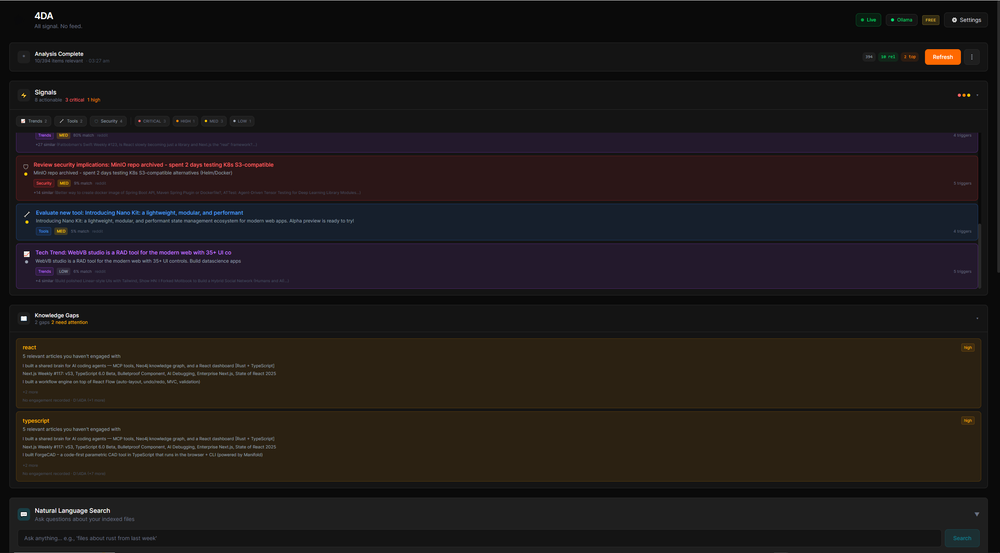
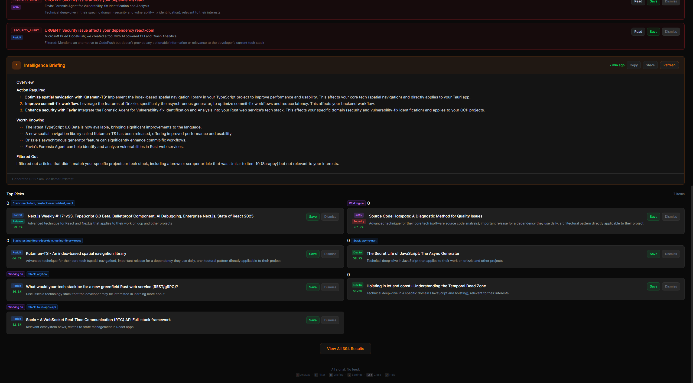
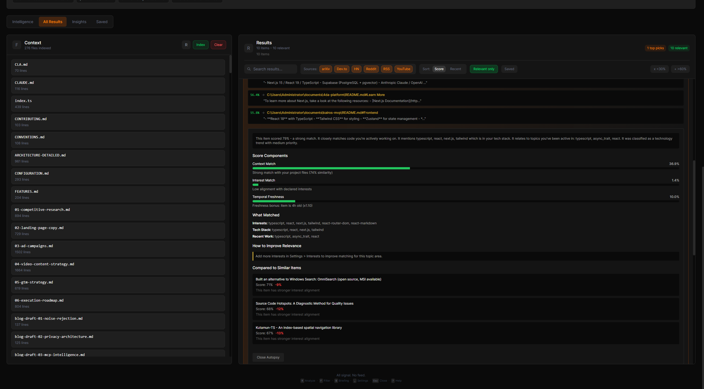
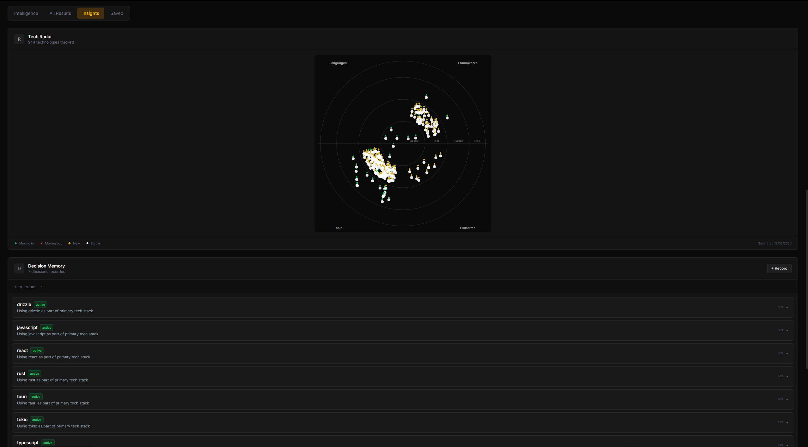

<div align="center">


<br />

[](LICENSE)
[](https://www.npmjs.com/package/@4da/mcp-server)
[](#download)

**All signal. No feed.**

</div>

---

4DA scans your codebase — `Cargo.toml`, `package.json`, `go.mod`, Git history — and scores every article, advisory, and release from 20+ sources against what you actually build. An item needs 2+ independent signals to survive. Everything else is rejected.

Typical rejection rate: **99%+**. What's left is yours.

Privacy-first. Runs locally. Zero telemetry. BYOK. Your data never leaves your machine.

<p align="center">
  
</p>

---

## How It Scores

5 independent signal axes. An item must pass **2 or more** to surface. Single-axis matches are hard-capped at 28% — no matter how strong one signal is, it cannot pass alone.

| Axis | What it measures |
|------|-----------------|
| **Context** | Semantic similarity to your active codebase |
| **Interest** | Alignment with your declared and learned topics |
| **ACE** | Real-time signals from your Git commits and file edits |
| **Dependency** | Direct matches against your installed packages |
| **Learned** | Save/dismiss feedback boosts or suppresses future scores |

What passes the gate goes through 12 quality multipliers: content depth, novelty detection, competing tech penalties, title-body coherence, and intent scoring from recent work. Every constant is calibrated across 9 simulated developer personas with 215 labeled test items.

### LLM Verification (Optional)

After keyword scoring, an optional LLM layer verifies the top items against your full developer context — stack, dependencies, recent commits, anti-technologies, and engagement history. Strict 1-5 rubric:

- **5 = MUST-READ**: Security alert for YOUR dependency, breaking change YOU must act on
- **3 = WORTH KNOWING**: Useful tool that fits YOUR exact stack
- **1 = NOISE**: Mentions your tech but isn't actionable

This is where gold nuggets surface — articles the keyword pipeline misses because there's no keyword overlap, but the LLM understands the conceptual relevance to your specific project.

**You control the compute.** Use [Ollama](https://ollama.com/) for free local inference (fully private), or bring your own Anthropic/OpenAI key. 4DA never pays for your compute, never stores your keys remotely, never makes API calls you didn't configure. No LLM = keyword pipeline only (85-90% accurate).

### It Gets Smarter

Every interaction is a training signal:

- **Save** → topics boost, source reputation rises, taste embedding sharpens
- **Dismiss** → topics suppress, anti-patterns form, future noise drops
- Autophagy cycles detect systematic over/under-scoring and self-correct
- Topic decay calibrates per-topic: "Rust" stays relevant for days, "JS framework of the week" decays in hours

### It Can't Be Gamed

Content creators who learn the scoring algorithm still can't game it:

- **Title-body coherence**: titles must deliver on what they promise. Claim "React + Rust + Tauri" but only discuss React? Penalty.
- **Keyword concentration**: repeating "Rust" four times in a title hurts your score.
- **Confirmation gate**: keyword-stuffing hits one axis. Without matching the user's codebase, installed packages, AND recent work — the gate rejects it.
- **Feedback loop**: gamed articles get dismissed. Sources that produce dismissed content lose reputation. Gaming becomes self-defeating.

No algorithm can be gamed when the scoring signal comes from your local filesystem. Your `Cargo.lock` doesn't lie. Your Git history doesn't optimize for engagement.

---

## Why Not Just Use...

| Tool | Approach | Limitation |
|------|----------|------------|
| **daily.dev** | Personalizes by engagement (what you click) | Optimizes for curiosity, not project relevance. Gameable by engagement farming. |
| **Feedly** | Aggregates by subscription (what feeds you add) | Solves aggregation, not relevance. AI features locked behind $156/yr. |
| **Pocket** | Saves what you manually bookmark | Read-it-later, not intelligence. Mozilla killed the team in 2023. |
| **TLDR / newsletters** | Someone else curates for "developers" broadly | One person's bias for all developers. Fits none precisely. |
| **4DA** | Scores against your actual codebase | Requires a local codebase to scan. That's the point. |

4DA scores by what you **build**, not what you click or subscribe to.

---

## Download

> **Pre-built binaries** — no Rust toolchain required.

| Platform | Download | Auto-updates |
|----------|----------|:------------:|
| **Windows** | [`.exe` installer](https://github.com/runyourempire/4DA/releases/latest) | Yes |
| **macOS** | [`.dmg` (Apple Silicon & Intel)](https://github.com/runyourempire/4DA/releases/latest) | Yes |
| **Linux** | [`.AppImage` / `.deb`](https://github.com/runyourempire/4DA/releases/latest) | Yes |

Or install the **MCP server** for Claude Code / Cursor:
```bash
npx @4da/mcp-server
```

## Quick Start (Build from Source)

**Prerequisites:** [Rust](https://rustup.rs/) 1.93+, [Node.js](https://nodejs.org/) 20+, [pnpm](https://pnpm.io/)

```bash
git clone https://github.com/runyourempire/4DA.git
cd 4DA
pnpm install
pnpm tauri dev
```

Onboard (pick your stack, add an API key, point at your projects), and run your first scan. First useful results in under 3 minutes.

---

## Architecture

```
Your Codebase                    External Sources
     |                                |
     v                                v
+-----------+                +--------------+
|    ACE    |                |  20+ Source   |
| Scanner + |                |  Adapters     |
| Git Watch |                |  (background) |
+-----+-----+               +------+-------+
      |                            |
      v                            v
+------------------------------------------+
|         5-Axis Scoring Engine            |
|                                          |
|  context --+                             |
|  interest --+- confirmation gate (2+/5)  |
|  ace -------+                            |
|  dependency-+  x quality x novelty       |
|  learned ---+  x domain  x intent        |
+------------------+-----------------------+
                   |
                   v
          +-----------------+
          |  What survived  |
          +-----------------+
```

| Layer | Technology |
|-------|-----------|
| App Shell | Tauri 2.0 (Rust backend + WebView) |
| Frontend | React 19 + TypeScript + Tailwind CSS v4 |
| Database | SQLite 3.45+ with sqlite-vec (vector search) |
| Scoring | Custom DSL -> build-time Rust codegen |
| Embeddings | OpenAI text-embedding-3-small / Ollama |
| LLM | Anthropic Claude / OpenAI / Ollama (BYOK) |

---

## Privacy & Trust

All data stays on your machine. Raw content never leaves. Zero telemetry. Zero analytics. Zero tracking. Zero user accounts.

- Core scoring is pure Rust — zero API calls, 2 seconds for 500 items, $0.00 per analysis
- LLM verification (optional): free with Ollama, or ~$0.05/analysis with your own cloud key
- BYOK: your keys, your models, your billing. We never touch your compute costs.
- With Ollama, the entire app runs fully offline

Don't take our word for it. Verify every claim:

| Document | What It Covers |
|----------|---------------|
| [**Trust Architecture**](docs/TRUST-ARCHITECTURE.md) | Why local-first means you don't need to trust us |
| [**Network Transparency**](docs/NETWORK-TRANSPARENCY.md) | Every outbound connection, with source code references |
| [**Privacy (Plain Language)**](docs/PRIVACY-PLAIN-LANGUAGE.md) | One-page, no-legalese privacy summary |
| [**Build from Source**](docs/BUILD-FROM-SOURCE.md) | Compile it yourself and verify the binary |
| [**Security Audit Guide**](docs/SECURITY-AUDIT-GUIDE.md) | Map of trust-critical code paths for auditors |
| [**Security Policy**](SECURITY.md) | Vulnerability reporting and security model |

---

## Pricing

**Free** — $0 forever. No credit card. No account. No expiration.
- All 20+ sources, full 5-axis scoring engine, AI daily briefings (BYOK), natural language search (BYOK), behavior learning, STREETS Playbook (all 7 modules), MCP server (33 tools), CLI

**Signal** — $12/month or $99/year. Compound intelligence that gets smarter every day.
- Everything in Free, plus: Signal tab intelligence (Key Signals + analytics), Score Autopsy (5-axis breakdown), Developer DNA profiling, signal chain analysis, knowledge gap detection, semantic shift tracking, attention analytics, standing queries, project health radar

---

## Features

<details>
<summary><strong>Intelligence</strong></summary>

- 5-axis scoring with multi-signal confirmation gate (99%+ rejection rate)
- Domain profile: graduated tech identity (primary stack -> dependencies -> detected -> interests)
- Content DNA: classifies content type (security advisory, release, tutorial, hiring, etc.)
- Novelty detection: demotes introductory content, boosts new releases and security advisories
- Role-aware scoring: security engineers see security content prominently; experience level adjusts tutorial/depth balance
- Intent scoring: recent Git/file activity influences what surfaces
- Knowledge gap detection: finds blind spots in your dependency understanding
- Anti-gaming: title-body coherence, keyword concentration, adversarial resistance built into the pipeline

</details>

<details>
<summary><strong>Sources</strong> — 20+ adapters, all running locally</summary>

- Hacker News, GitHub, Reddit, YouTube, arXiv, Stack Overflow
- Lobsters, DEV.to, Product Hunt, Twitter/X, Bluesky, Hugging Face
- Papers with Code, crates.io, npm, PyPI, Go modules
- CVE/OSV vulnerability databases, custom RSS feeds

</details>

<details>
<summary><strong>Analysis</strong></summary>

- Signal chains: tracks evolving stories across sources
- Semantic shift detection: notices when topics you follow are changing
- Reverse mentions: finds where your projects are discussed
- Project health radar: dependency freshness + security monitoring
- Attention dashboard: where you spend time vs. where you should

</details>

<details>
<summary><strong>Decision Intelligence</strong></summary>

- Record and query architectural decisions across sessions
- Tech radar: adoption signals from decisions + content trends
- Decision enforcement: AI agents check alignment before suggesting changes

</details>

<details>
<summary><strong>Agent Autonomy</strong></summary>

- Cross-session, cross-agent persistent memory
- Session briefs: tailored startup context for any AI tool
- Delegation scoring: should the agent proceed or ask you?
- Developer DNA: exportable tech identity profile (markdown, SVG, or shareable card)

</details>

<details>
<summary><strong>MCP Integration</strong> — 33 tools across 8 categories</summary>

Plug your intelligence system directly into Claude Code, Cursor, or any MCP-compatible tool.

```bash
npx @4da/mcp-server
```

**Core** — `get_relevant_content`, `get_context`, `explain_relevance`, `record_feedback`
**Intelligence** — `daily_briefing`, `get_actionable_signals`, `score_autopsy`, `trend_analysis`, `context_analysis`, `topic_connections`, `signal_chains`, `semantic_shifts`, `attention_report`
**Diagnostic** — `source_health`, `config_validator`, `llm_status`
**Innovation** — `knowledge_gaps`, `project_health`, `reverse_mentions`, `export_context_packet`
**Decision Intelligence** — `decision_memory`, `tech_radar`, `check_decision_alignment`
**Agent Autonomy** — `agent_memory`, `agent_session_brief`, `delegation_score`, `record_agent_feedback`, `agent_feedback_stats`, `what_should_i_know`
**Developer DNA** — `developer_dna`
**Intelligence Metabolism** — `autophagy_status`, `decision_windows`, `compound_advantage`

</details>

<details>
<summary><strong>CLI</strong></summary>

Reads from the same database as the desktop app. No extra setup.

```bash
4da briefing               # Latest AI briefing
4da signals                # All classified signals
4da signals --critical     # Critical/high priority only
4da gaps                   # Knowledge gaps in your dependencies
4da health                 # Project dependency health
4da status                 # Database stats
```

</details>

---

## Screenshots

<p align="center">
  
  <br />
  <em>Intelligence Briefing — AI-generated daily summary with curated top picks</em>
</p>

<p align="center">
  
  <br />
  <em>Score Autopsy — see exactly why an item scored the way it did</em>
</p>

<p align="center">
  
  <br />
  <em>Tech Radar, Decision Memory, and Developer DNA</em>
</p>

---

## Development

```bash
pnpm tauri dev              # Dev server (localhost:4444)
cargo test                  # Rust tests (from src-tauri/)
pnpm test                   # Frontend tests
pnpm validate:all           # Full validation (lint + types + tests + build)
```

## License

[FSL-1.1-Apache-2.0](LICENSE) — free to use. Source available for inspection. Converts to Apache 2.0 two years after each release.

---

<div align="center">

**4DA** — *4 Dimensional Autonomy*

All signal. No feed.

---

"4DA" and the 4DA logo are trademarks of 4DA Systems Pty Ltd (ACN 696 078 841).
The [FSL-1.1-Apache-2.0](LICENSE) license does not grant rights to use these trademarks.

</div>
